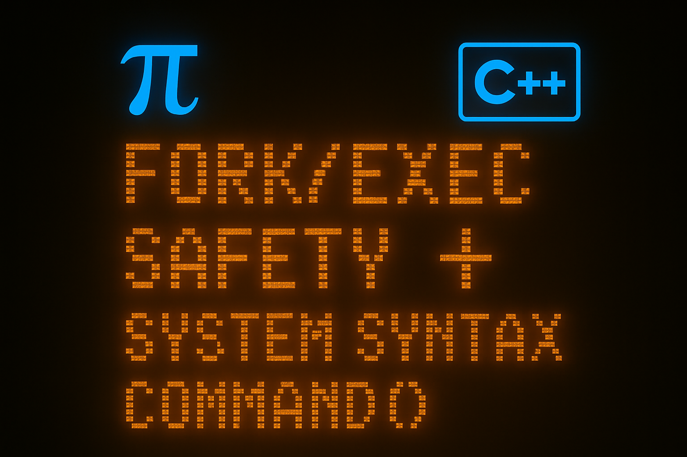

# command() Function

## What is `command()`?
- `command()` is a small but powerful FOSS C++ function.
- Its formula is basically: **system()-like syntax + fork()/exec() safety = command()**
- Designed to provide an easy, readable, shell-free way to run system commands.

## Philosophy / History
While developing my project [`pacostrap`](https://github.com/npc-gnu/pacostrap), I realized:
- `system()` is too risky due to shell injection.
- `fork()` and `exec()` are safe, but painful to read and write.

So I wrote my own wrapper — `command()` — a minimal, readable and safe way to execute commands.

## Example Usage
```cpp
#include <iostream> // for cout, main, return function
#include <string> // for string valuable
#include "command.hpp" // for my own super duper awesome command function
int main() {
    std::cout << "Enter directory:\n";
    std::string directory;
    std::cin >> directory;
    command("ls -a " + directory);
    return 0;
}
```
## Licensing
This project is licensed under the GNU Affero General Public License v3 (AGPLv3).
Allowed License Reuse:
You may reuse this function in projects that are licensed under copyleft (strong or weak) licenses, such as:
   - GNU GPLv2, GPLv3, AGPLv3, LGPLv2, LGPLv3
   - SSPL
   - EUPL
   - CeCILL v2.1
   - OSL
   - RTPL
   - MPL
   - Not Allowed Without Permission:
    Projects using non-copyleft permissive licenses (MIT, BSD, Apache)
If you want to use command() in such a context, please contact me at:
 8.000.000zimbabwe_dolar@protonmail.com
I do not support the use of my code by corporations that exploit FOSS or contribute to closed platforms like macOS or FreeBSD.
I believe in software freedom — not as a business model, but as a moral stance.  
If that makes me "less pragmatic", so be it.  
